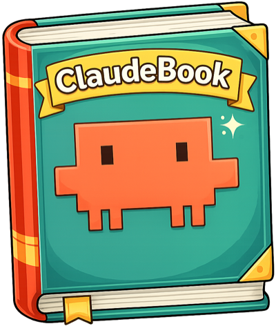

<p align="center">
  
</p>

<p align="center">
  Recipes for Claude Code — commands, skills, and configs.
</p>

<p align="center">
  A curated collection of reusable <a href="https://docs.anthropic.com/en/docs/claude-code">Claude Code</a> skills that codify common development workflows. Drop them into any project and let Claude handle the tedious parts — committing, rebasing, opening PRs, triaging review feedback, and implementing issues — all following your team's conventions.
</p>

## What's inside

```
skills/
├── commit-changes.md       # Stage & commit with conventional commits
├── implement-issue.md      # Fetch a GitHub issue and implement it end-to-end
├── incorporate-feedback.md # Triage and address PR review comments
├── pull-request.md         # Open a PR with a structured description
└── rebase-on-main.md       # Rebase on main and resolve conflicts
```

## Quick start

### 1. Clone the repo

```sh
git clone https://github.com/utensils/claudebook.git
```

### 2. Copy skills into your project

Skills live in your project's `.claude/skills/` directory. Copy the ones you want:

```sh
# Copy all skills
cp claudebook/skills/*.md your-project/.claude/skills/

# Or pick individual skills
cp claudebook/skills/commit-changes.md your-project/.claude/skills/
```

### 3. Use them in Claude Code

Once installed, invoke a skill with the slash command syntax:

```
/commit-changes
/pull-request
/rebase-on-main
/implement-issue #42
/incorporate-feedback
```

## Skills

### `/commit-changes`

Runs pre-flight checks (format, lint, typecheck, test), reviews your diff, stages files individually, and creates a commit using [conventional commit](https://www.conventionalcommits.org/) format. Automatically groups unrelated changes into separate commits and refuses to stage secrets.

### `/implement-issue`

Takes a GitHub issue number, fetches the full issue with comments, researches the codebase, asks clarifying questions if the spec is ambiguous, enters plan mode for your approval, then implements the changes with tests. Leverages subagents for parallel work when possible.

### `/incorporate-feedback`

Fetches all review comments on the current branch's PR, triages each one (incorporate vs. decline), makes the changes, responds to every comment with what was done and why, then commits and pushes.

### `/pull-request`

Runs pre-flight checks, rebases on `origin/main`, analyzes the full diff, and opens a PR with a structured body including summary, complexity notes, test steps, and a checklist. Automatically adds the `migration` label when Prisma migrations are detected.

### `/rebase-on-main`

Checks for uncommitted work, fetches and rebases on `origin/main`, resolves conflicts file-by-file (asking for help on ambiguous ones), and verifies everything still passes.

## Customization

These skills are starting points. Fork and adapt them to match your team's stack and conventions:

- **Swap the toolchain** — The skills reference `pnpm`, `tsc`, and Prisma. Replace these with whatever your project uses (`npm`, `yarn`, `bun`, `ruff`, `cargo`, etc.).
- **Adjust commit conventions** — The commit skill uses conventional commits. Modify the format, types, and scopes to match your team's style.
- **Change the PR template** — Add or remove sections from the PR body to match your team's review process.
- **Add new skills** — Create a new `.md` file in `skills/` following the same structure: a one-line description, a `## Steps` section with numbered steps, and optional `## Examples`.

## Writing your own skills

A skill is a markdown file that tells Claude Code how to perform a task. The structure is simple:

```markdown
One-line description of what this skill does.

## Steps

1. **Step name** — What to do:
   - Specific sub-steps with exact commands
   - Decision points and branching logic
   - Error handling instructions

2. **Next step** — Continue the workflow:
   - More sub-steps
   ...
```

Tips for effective skills:

- **Be explicit** — Specify exact commands, flags, and tool names. Claude follows instructions literally.
- **Handle failure** — Tell Claude what to do when a step fails (fix it, stop and ask, skip, etc.).
- **Use `$ARGUMENTS`** — Reference user-provided arguments with `$ARGUMENTS` for parameterized skills (see `implement-issue.md`).
- **Keep steps ordered** — Claude executes steps sequentially. Put checks before actions and verification after changes.
- **Scope narrowly** — One skill per workflow. Compose them rather than building monolithic skills.

## Contributing

Contributions are welcome! If you have a skill that's been useful across projects, open a PR. Please ensure:

1. The skill follows the structure outlined in [Writing your own skills](#writing-your-own-skills)
2. Steps are concrete and actionable (not vague or aspirational)
3. The skill is general enough to be useful beyond a single project

## License

[MIT](LICENSE)
